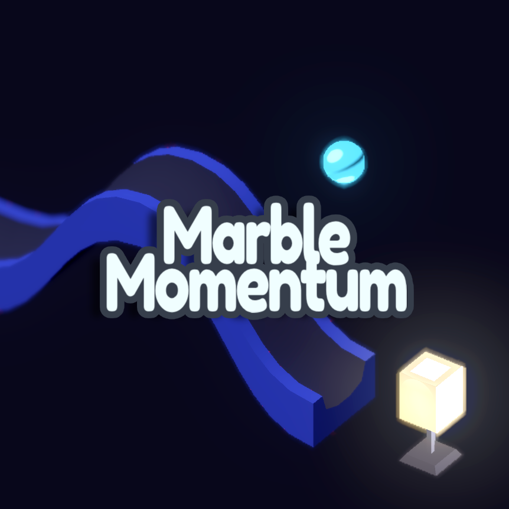

# Marble Momentum

> ​Set the path and just get started!

Marble Momentum is a 3D physics puzzle game where every level is a chain reaction waiting to be triggered.
Drop a single marble and sit back to relax and watch the tracks, fans, dominoes, and more pave the marble's path.
Every bounce, push, and adjustment is fun! You can tweak things like fans, slopes and more with a simple click, then drop the marble and enjoy the dynamic, cause-and-effect spectacle.

The game is made in Godot Engine

## How to Play

The game is pretty simple actually. At the start of each level, you may change the different components the level has. For example in some levels you can change the slop angle,
and in some you can toggle fans on or off, or some other components. All of them allow for a lot of exciting paths that would guide the marble. 

After setting everything, press Space or click the Start button to roll the marble. Then just watch the marble roll and hope it lights up the switch. If not, try again with different settings.
You can press R or click the reload icon at the top to restart the level at any time. After hitting the light on, next level will be loaded automatically.

You can click the home button to go back to the main menu.

## ATTRIBUTIONS

See attributions in [ATTRIBUTIONS.md](ATTRIBUTIONS.md)
